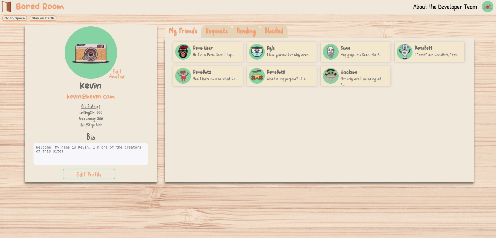
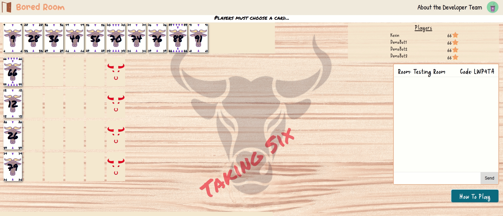
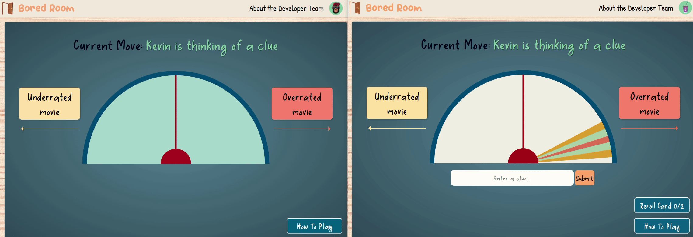

# Bored Room

Have you ever wanted to play your favorite board games online with friends but not know which game you want to play? Was it difficult because there were too many sites for individual games and signing up all your friends is a chore? Do the game websites you've tried require you to refresh the page to see the latest moves?

Introducing [Bored Room](https://bored-room.herokuapp.com/), a web platform designed for people to play modern board games online with friends and strangers both asynchronously and in real time! Our goal was to create a family-friendly, entertaining space to explore modern board games whether you're a board game veteran or new to the scene. Not only can your friends easily join rooms you create, but you can also learn how to play new games by testing out our demo feature where you play against our demobots! To make things easier for new users a brief set of rules can be seen at the bottom of every page. In addition, from a backend and engineering point of view we designed Bored Room to easily incorporate new games whenever they are designed by implementing our game logic with a State Design Pattern.

### Languages and Technologies ###
  * React/Redux
  * Express.js
  * Node.js
  * MongoDb and Mongoose
  * Socket.io
  * Framer Motion
  * Vanilla JavaScript
  * HTML5/CSS
  * Canvas
  * Webpack/Nodemon

## Profiles ##
On your profile page you are able to see your current friends, requests, pending requests and blocked users. In addition you are able to change your avatar, handle, email and bio to share with the Bored Room community a little bit about yourself and about what makes you...you!


## Demo Game and State Queue ##
Our Taking Six Demo highlights our queue system for dispatching state as well as our animations using Framer Motion.


## Websockets and Canvas ##
While all of our games use websockets, it's highlighted the most in our Frequency game where multiple users on the same team can affect the central dial. However, in consideration of computers with lower processing power we only update the dial on mouse release. The dial itself is created entirely in canvas and can be manipulated by using trigonometry to convert our mouse-click position into an angle.


## Code Snippets ##

### Redux Queue System ###
The following code snippet was an interesting challenge for us because we needed to display changes in the state of the game that were automated on the backend. For example, the game and demobots might automatically place cards, score points, and setup a new turn. The server goes through each game state within milliseconds on the backend and delivers the new state in json format to our frontend. While we could've used external libraries like redux saga to delay our dispatch we implemented our own queue system with setTimeout that would dispatch each state after a short duration. This allows the user to see game changes easily as well as allowing us to play animations for certain games.

```jsx
  useEffect(() => {
    dispatch(fetchGame(roomCode));
    socket.on('game_updated', (game) => {
      setStateQueue(oldState =>  [...oldState, game])
    });

    return () => {
      timerRef.current.forEach(timer => clearTimeout(timerRef));
    }
  },[]);

  useEffect(() => {
    if(!isDelayed && stateQueue.length > 0){
      let nextUpdate = stateQueue[0];
      if(nextUpdate.gameState.type === 'automated') {
        setIsDelayed(true)

        const timer = setTimeout(() => {
          setStateQueue(oldState => oldState.slice(1));
          dispatch(receiveGame(nextUpdate))
          setIsDelayed(false)
          setTimers(oldState => oldState.slice(1));
        }, 1200);

        setTimers(oldState => [...oldState, timer]);
      } else {
        setStateQueue(oldState => oldState.slice(1));
        dispatch(receiveGame(nextUpdate))
      }
    } 
  }, [stateQueue, isDelayed])
```
### Friendships ###
One of our goals for this project was to create a profile system where you can add other users as friends. One of the complications with this is that the friendship relationship is a two-way street, which becomes slightly more difficult to do in a NoSQL non-relational database. Requesting a friendship requires that the requestee's pendingFriends is also updated. By having users be within four possible arrays that represent friendship status we can take a potentially complex relationship and make them much easier to work with.

```jsx
const UserSchema = new Schema({
  //...
  acceptedFriends: [{
    type: mongoose.Schema.Types.ObjectId,
    ref: 'User',
  }],
  requestedFriends: [{
    type: mongoose.Schema.Types.ObjectId,
    ref: 'User',
  }],
  pendingFriends: [{
    type: mongoose.Schema.Types.ObjectId,
    ref: 'User',
  }],
  rejectedFriends: [{
    type: mongoose.Schema.Types.ObjectId,
    ref: 'User',
  }],
  //...
 })
```

```jsx
router.post('/request/:friendId', passport.authenticate('jwt', {session: false}), async (req, res) => {
  try {
    const requester = await User.findOneAndUpdate(
      { _id: req.user._id, acceptedFriends: { $ne: mongoose.Types.ObjectId(req.params.friendId) } },
      { $addToSet: { requestedFriends: mongoose.Types.ObjectId(req.params.friendId) }},
      { new: true })
  
    const requestee = await User.findOneAndUpdate(
      { _id: req.params.friendId, acceptedFriends: { $ne: req.user._id }, rejectedFriends: { $ne: req.user._id } },
      { $addToSet: { pendingFriends: req.user._id }},
      { new: true })
    // requestee or requester will return null if the $ne condition is met.
  
    res.json(requester || req.user)
  } catch (error) {
    res.status(422).json(error)
  }
})
```
